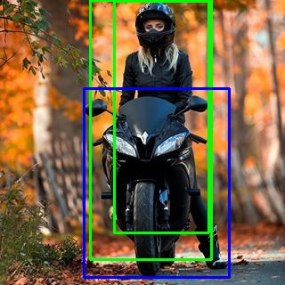
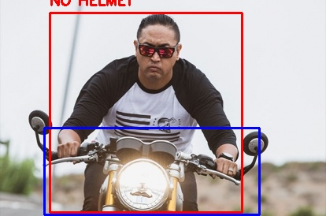

# Helmet Detection for Motorcycle Riders (YOLO)

This project detects motorcycle riders and identifies whether they are wearing a helmet using a YOLO-based object detection approach.

## How it works
- Uses a pre-trained YOLOv8 model to detect persons and motorcycles
- Identifies the motorcycle rider by checking overlap between person and motorcycle
- Checks the rider’s head region for helmet presence
- Labels riders as **HELMET ON** or **NO HELMET**

## Tech Stack
- Python
- YOLOv8 (Ultralytics)
- OpenCV
- NumPy

## How to Run
1. Create and activate a virtual environment
2. Install dependencies:
3. Place a test image at:
4. Run detection:

## Output
The output image with detection results is saved as:

## Notes
- Helmet detection depends on model capabilities and image quality
- This project focuses on logic and system design rather than custom model training

##  Sample Results

### Helmet On

### No Helmet (Violation)

